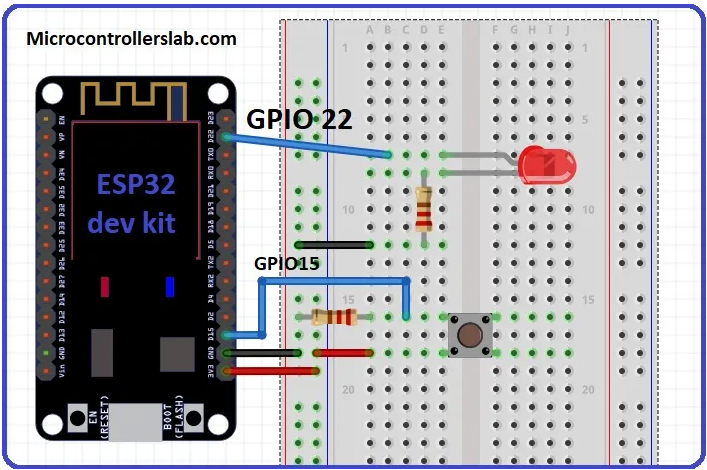

# PRACTICA 2  : INTERRUPCIONES

En esta práctica vamos a realizar dos tipos de interrupciones mediante nuestro microprocesador ESP32.
En primer lugar haremos un programa que al pulsar un botón analógico se produzca la interrupción y en segundo lugar lo haremos mediante un timer del microprocesador.

## A: Interrupción por botón

### Código

```cpp
struct Button {
const uint8_t PIN;
uint32_t numberKeyPresses;
bool pressed;
};

Button button1 = {18, 0, false};

void IRAM_ATTR isr() {
button1.numberKeyPresses += 1;
button1.pressed = true;
}


void setup() {

Serial.begin(9600);
pinMode(button1.PIN, INPUT_PULLUP);
attachInterrupt(button1.PIN, isr, FALLING);

}

void loop() {

if (button1.pressed) {
Serial.printf("Button 1 has been pressed %u times\n", button1.numberKeyPresses);
button1.pressed = false;
}


//Detach Interrupt after 1 Minute
static uint32_t lastMillis = 0;
if (millis() - lastMillis > 60000) {
lastMillis = millis();
detachInterrupt(button1.PIN);
Serial.println("Interrupt Detached!");
}

}
```

### Funcionamiento del programa

Primero de todo nos encontramos la Tupla Button y su función es guardar el número de pin en el cual se ha conectado el botón analógico, también guarda el número de veces que se ha pulsado el botón y finalmente contiene un bool que nos indica el estado.

Como podemos ver en el código de abajo, se crea un bootón y se le asigna el pin 18 y lo inciamos en 0 numero de veces que se ha pulsado.

```cpp
struct Button {
const uint8_t PIN;
uint32_t numberKeyPresses;
bool pressed;
};

Button button1 = {18, 0, false};
```

En el siguiente trozo de código nos encontramos con la función ISR. Esta se ejecutara cuando la interrupción suceda y hasta entonces no tendrá ninguna fucnión. Entonces supongamos que el bóton analógico sea pulsado, entonces la función ISR nos permitirá incrementar en uno el numero de veces que se ha pulsado el botón (uint32_t numberKeyPresses) y declarará el estado como true, que entenedemos como pulsado.

```cpp
void IRAM_ATTR isr() {
button1.numberKeyPresses += 1;
button1.pressed = true;
}
```  

Si seguimos analizando el código nos encontramos con la función Setup. Esta función declara el begin del puerto serie permitiendo imprimir resultados por pantalla. También declara el pin que nosotros deseamos para que haga la función de botón. Finalmente encontramos la función "attachInterrupt" que permite que la función ISR actúe cuando se detecta una pulsación.

```cpp
void setup() {

Serial.begin(9600);
pinMode(button1.PIN, INPUT_PULLUP);
attachInterrupt(button1.PIN, isr, FALLING);

}
```

Finalmente nos encontramos con la función Loop que trata de regular la posición del botón. Funciona de manera que una vez se haya pulsado el botón, vamos a imprimir por pantalla el número de veces que ha sido pulsado y luego volveremos a darle valor de "no pulsado". 

```cpp
void loop() {

if (button1.pressed) {
Serial.printf("Button 1 has been pressed %u times\n", button1.numberKeyPresses);
button1.pressed = false;
}


//Detach Interrupt after 1 Minute
static uint32_t lastMillis = 0;
if (millis() - lastMillis > 60000) {
lastMillis = millis();
detachInterrupt(button1.PIN);
Serial.println("Interrupt Detached!");
}
```
### Diagrama de Funcionamiento


